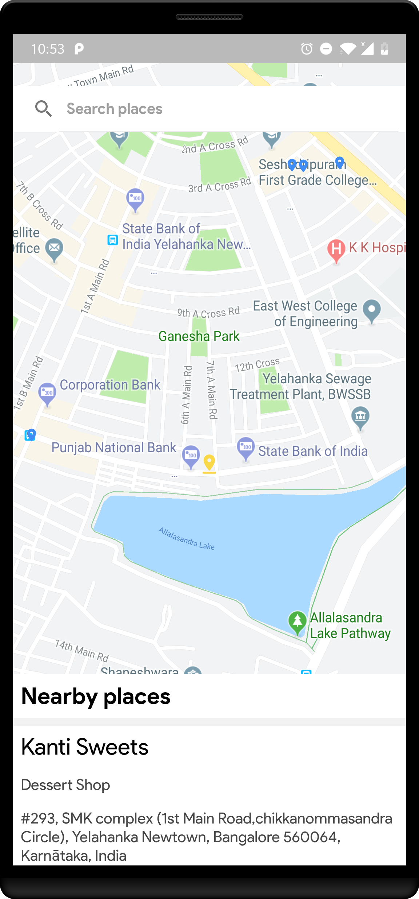
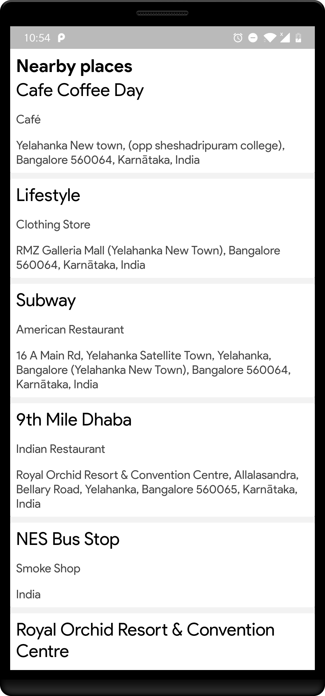
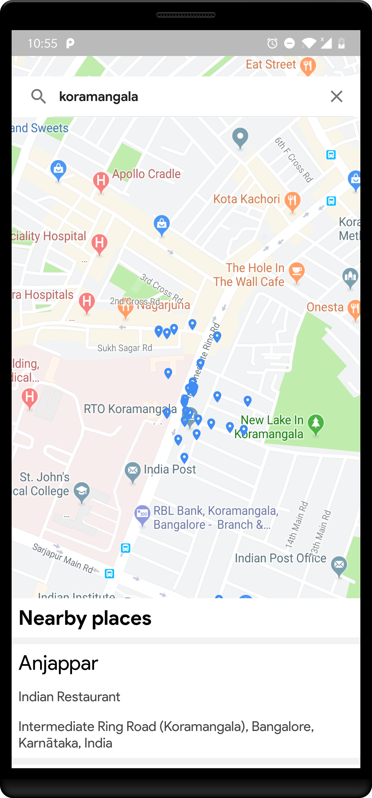

# Explore-Places
An android app using which the user can get details about places near him

I have used the following components to create this app:

1. MVVM as the application architecture
2. Retrofit for network calls
3. Room for offline storage
4. Dagger for dependency injection
5. RxJava to observe the API response
6. MockWebServer to test the API

You can find the signd apk [here](app/release/)

## App screenshots

### 1. Splash screen

### 2. Main screen

#### a. Display near by places

  Once splash screen activity is completed the user will be in the main screen.

  First, the app will fetch the current location of the user i.e the latitude and longitude.

  With this, it will hit the following API to fetch nearby places:

  https://api.foursquare.com/v2/venues/explore

  After fetching the places, I am showing those places on the map and also I have used Bottom Sheet Fragment to show the details of       those places in a list.

  

  

#### b. Search places

  The user can also search for a place.
  
  Once the user enters the name of the place, the app will hit the following API to fetch places nearby to the place entered by the       user:
  
  https://api.foursquare.com/v2/venues/search
  
  Again, after fetching the places I am showing those places on the map and the details of those places in Bottom Sheet Fragment
  
  
  
  
